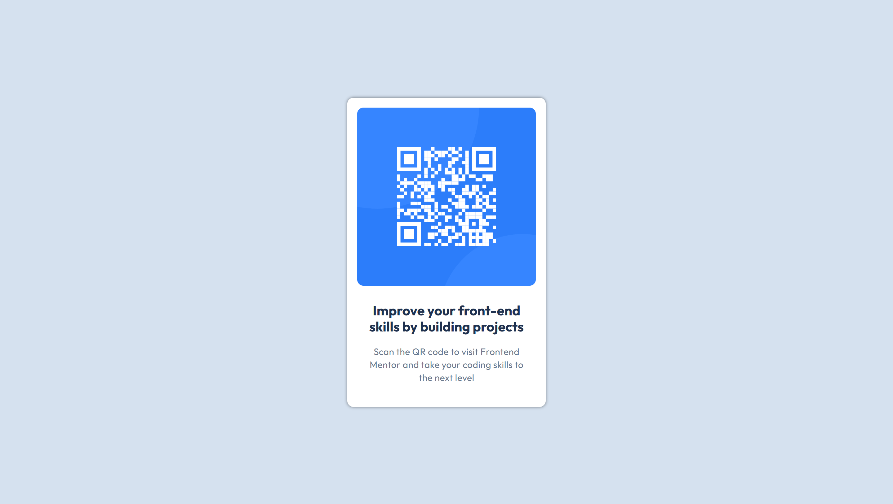

# Frontend Mentor - QR code component solution

This is a solution to the [QR code component challenge on Frontend Mentor](https://www.frontendmentor.io/challenges/qr-code-component-iux_sIO_H). Frontend Mentor challenges help you improve your coding skills by building realistic projects.

## Table of contents

- [Overview](#overview)
  - [Screenshot](#screenshot)
  - [Links](#links)
- [My process](#my-process)
  - [Built with](#built-with)
  - [What I learned](#what-i-learned)
  - [Continued development](#continued-development)
- [Author](#author)

**Note: Delete this note and update the table of contents based on what sections you keep.**

## Overview

### Screenshot

### Links

- Solution URL: [Github Repository](https://github.com/jjurelvalenzuela/qr-component)
- Live Site URL: [Github Page](https://jjurelvalenzuela.github.io/qr-component/)

## My process

### Built with

- Basic HTML
- Basic CSS
- Flexbox
- Mobile-first workflow

### What I learned

I'm currently familiarizing myself with the basics. Right now, it feels a bit uncomfortable building things and striving for perfection. Instead of worrying about perfecting the design, I'm focusing on becoming comfortable with using the technology.

### Continued development

I'll keep building beginner projects until I feel comfortable, gradually increasing the difficulty over time. I know my current project isn't perfect, but I'll continue to improve it. With time, it will become great and visually appealing.

## Author

- Website - [Coming Soon!](#)
- Frontend Mentor - [@jjurelvalenzuela](https://www.frontendmentor.io/profile/jjurelvalenzuela)
